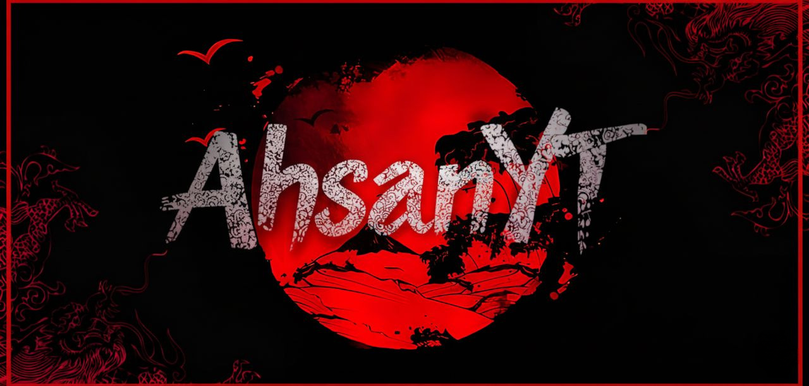

<div align="center">



<br><br>

<pre>
 █████╗ ██╗  ██╗███████╗ █████╗ ███╗   ██╗    ███████╗ ██████╗ ██╗     
██╔══██╗██║  ██║██╔════╝██╔══██╗████╗  ██║    ██╔════╝██╔═══██╗██║     
███████║███████║███████╗███████║██╔██╗ ██║    ███████╗██║   ██║██║     
██╔══██║██╔══██║╚════██║██╔══██║██║╚██╗██║    ╚════██║██║   ██║██║     
██║  ██║██║  ██║███████║██║  ██║██║ ╚████║    ███████║╚██████╔╝███████╗
╚═╝  ╚═╝╚═╝  ╚═╝╚══════╝╚═╝  ╚═╝╚═╝  ╚═══╝    ╚══════╝ ╚═════╝ ╚══════╝
</pre>

### [ AH4 TC | DARK GHOST v1.2 ]

**"Our democracy has been hacked. Our privacy has been compromised. The system is broken. We are here to show you how."**

[](https://www.python.org/)
[](https://github.com/ahsan13411/dark-ghost)
[](https://github.com/ahsan13411)

</div>

---

## 🎭 
> "Control is an illusion. We live in a world where everything is connected, yet everything is vulnerable. We don't just break systems; we reveal the cracks that were already there. Information wants to be free, and we are its messengers. We are the architects of chaos in a world that demands order. We are the ghost in the machine."

---

## 🚀 Features
- **Advanced IP Tracker:** Continent, Country, ISP, Organization, and Proxy/VPN detection.
- **Phone Number Intelligence:** Location, Carrier, Timezone, and Number Type (Mobile/Fixed).
- **Social Media Scanner:** Scans 23+ platforms for any username (Instagram, TikTok, FB, etc).
- **Node Intelligence:** Real-time system monitoring (IP, MAC, Hostname, Kernel).
- **Cross-Platform:** Works on Windows, Linux, and Termux.

---

## 🛠️ Installation & Usage (window,linux,termux)

### 1. Clone the Repository
```bash
git clone https://github.com/ahsan13411/darkghost.git
cd "darkghost"
```

### 2. Install Dependencies
```bash
pip install -r requirements.txt
```

### 3. Run the Tool
```bash
python darkghost.py
```

---

## 👤 Credits & Intelligence
- **Lead Operator:** [AHSAN](https://github.com/ahsan13411)
- **Central Intelligence:** [AH4 Team](https://github.com/ahsan13411)
- **Sector:** **Network Infiltration & Protocol Research**

---

<div align="center">
  
  
</div>


